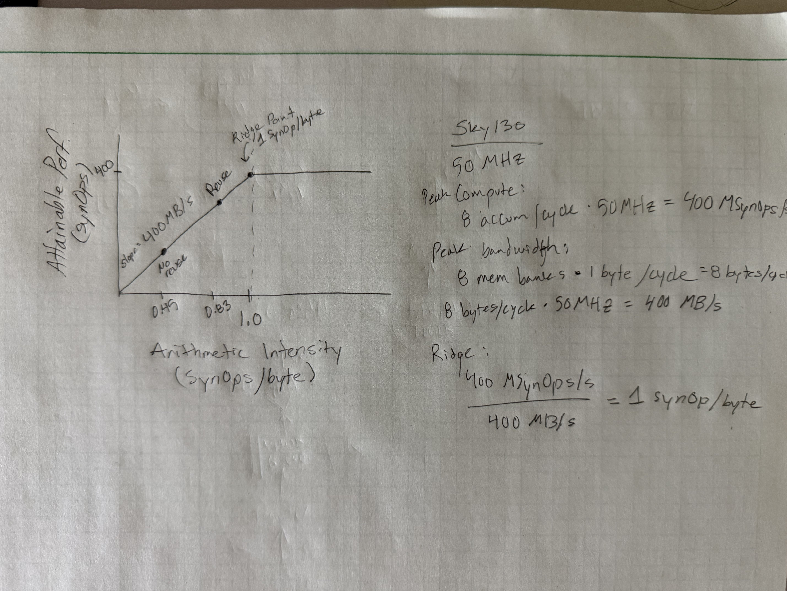

# CF09 CMAN: AI of my project kernel

1. The dominant kernel is, as one might expect, matrix multiply. In my case it is a matrix-vector multiply in my INT8 MAC accumulator. This is mainly due to the weight loading (memory wall). In some SNN implementations, the dominant kernel might be the neuron update, but my neuron array is relatively small.

2. My newest design, unlike the original, is fully event-based and sparse as an SNN should be. This also means the usual FLOPs = 2*MACs doesn't hold. Instead, SNNs often use SynOps (or SUPS for synaptic updates per second, analogous to FLOP vs FLOP/s) for synaptic operations.

SynOps (per step) = active_neurons * total_neuron_updates

For my design, this is (r * 200) * 200, where r = "firing rate" or the sparsity, and I have a 200 LIF neuron array. Given a reasonable 10% sparsity rate and 100 steps per invocation, this is:

SynOps = 100 * (r * 200) * 200 = 400000 SynOps.

3. Continuing from #2, my SNN is not GEMM-style. It fetches and computes sparse spikes and accumulates the outputs. Reuse is tricky, because really there isn't any, unless the same neuron fires a second time. In any case, here is my thinking:

**Lower bound / no reuse:**

Assume weights are fetched from memory every step.

With 1 byte per weight and 4 bytes accumulators, I have 2 * 200 neurons * 4 bytes/neuron = 1600, and this transfer happens three times (accumulate, synaptic update, synaptic writeback for new state). 4800 bytes total per step.

Bytes = (200 * s) + 4800, where s = active spikes. Again, with 10% sparsity (s = 20), Bytes = 8800 bytes.

**Upper bound / with reuse**

This is only the base, 4800 bytes. This is only the state data, since the weights would only be loaded once.

4. Arithmetic Intensity and roofline

AI (no reuse @ 10% sparsity) = (200 * 20) / 8800 = 0.45 SynOps/byte

AI (perfect reuse) = (200 * 20) / 4800 = 0.83 SynOps/byte

5. Summary

My design is limited by the on-chip memory bandwidth. I am heavily memory bound. To improve, I would need to increase my SynOps, which would require higher sparsity or some kind of batching where I don't have to move as much data per inference.
